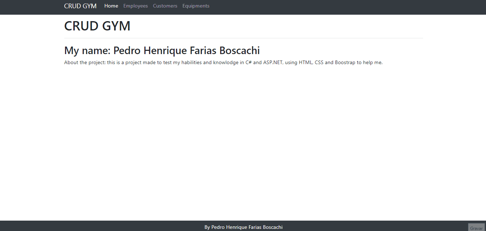
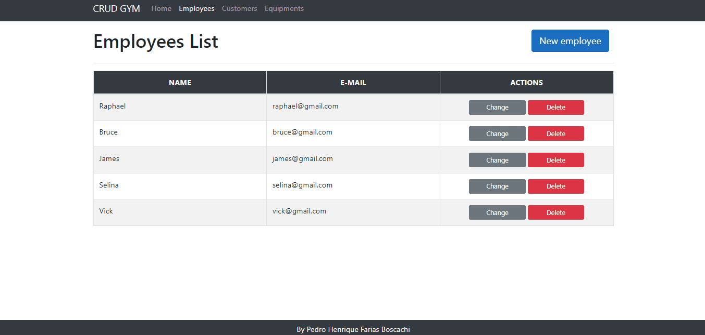
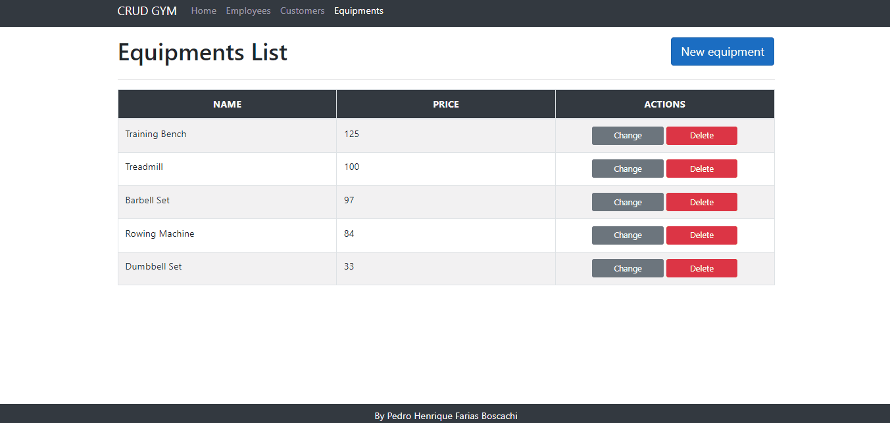

Project Link: https://dotnetgym.herokuapp.com/

## 🧠 About 

This project was made to test improve my habilites in C# and ASP.NET. Consists of a program that can insert, return, edit and remode data. The main theme is gym, so in the program the are employees, customers and equipment.

## -----Showing the Project-----
<h3>Home</h3>

<h3>Adding, removing and editing Employees</h3>

<h3>Adding, removing and editing Customers</h3>

<h3>Adding, removing and editing Equipments</h3>

## 🔨 Tools

- [.Net](https://dotnet.microsoft.com/en-us/)
- [C#](https://docs.microsoft.com/pt-br/dotnet/csharp/)
- [ASP.NET](https://dotnet.microsoft.com/en-us/apps/aspnet)
- [HTML](https://pt.wikipedia.org/wiki/HTML5)
- [CSS](https://developer.mozilla.org/pt-BR/docs/Web/CSS)
- [Bootstrap](https://getbootstrap.com/)
